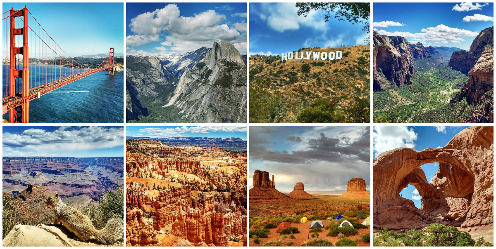
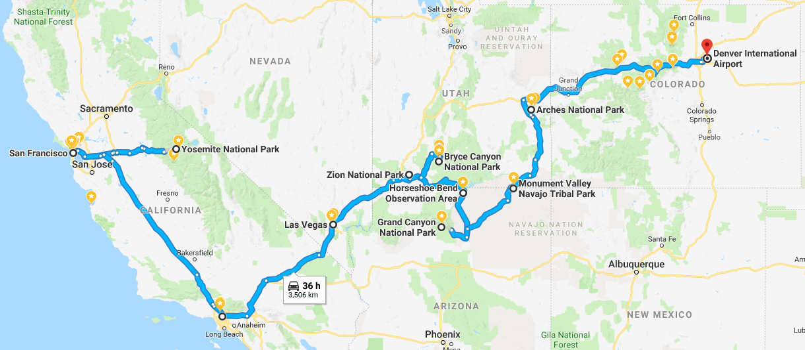

<!-- TODO:
    - add duration of travel for each day, and a breakdown of hours per day so that everyone has an estimate of how much time they should Suspendisse
    - add map at the top of each post for the route of that day5
    - add your own or other people 360 photos and/or videos
-->

**Travel date:** May 2017  
**Duration of the trip:** 10 full days + 2 for arrival/departure flights  
**Main locations:** San Francisco (start), Yosemite NP, Los Angeles, Las Vegas, Zion NP, Bryce Canyon NP, Horseshoe Bend, Grand Canyon NP, Monument Valley Navajo Tribal Park, Arches NP, Denver (finish)  
**Group size:** 2 people  
**Estimated cost per person:** $1300 + flight to San Francisco + flight from Denver  
**Total driving time**: 36+ hours  
**Total distance**: 3506+ km  

_**Note:** click on the images to enlarge them_  
_**Common abbreviations:** SF (San Francisco), NP (National Park), LA (Los Angeles)_

# Table of contents

- [Tips & Advice](#tipsandadvice)
- [Packing List](#packinglist)
- [Cost summary of the trip](#costoftrip)
- [Weather expectetions](#weather)
- [Schedule](#schedule)
  - [Day 1: Arrival to San Francisco](#day1)
  - [Day 2: San Francisco &rarr; Yosemite NP &rarr; Oakland](#day2)
  - [Day 3: Basketball game &rarr; Golden Gate Bridge &rarr; Sausalito](#day3)
  - [Day 4: Sausalito &rarr; San Francisco &rarr; Los Angeles](#day4)
  - [Day 5: Los Angeles &rarr; Las Vegas](#day5)
  - [Day 6: Las Vegas](#day6)
  - [Day 7: Las Vegas &rarr; Zion NP](#day7)
  - [Day 8: Zion NP &rarr; Bryce Canyon NP](#day8)
  - [Day 9: Bryce Canyon NP &rarr; Horseshoe Bend &rarr; Grand Canyon NP](#day9)
  - [Day 10: Grand Canyon NP &rarr; Monument Valley](#day10)
  - [Day 11: Monument Valley &rarr; Arches NP &rarr; Denver](#day11)
  - [Day 12: Departure from Denver](#day12)

## Tips & Advice {#tipsandadvice}
***
- Check the _national parks app_ by Rei
- Check freecampsites.net for dispersed (wild camping) free camping
- Get national parks pass if you intend to visit multiple parks. Valid for a year, transferable to someone else
- Check opening dates for all parks, routes or monuments. Also check usual weather conditions for that time of the year, as it might not be worth it if it’s too cold/rainy
- Eat at any of the multiple In-n-out restaurants (it’s like McDonalds but much better and cheaper. It’s an american classic)
- If I indicate a place with a combination of numbers and letters like 857CX23X+RX is because it’s a plus code, which can be used in google maps to search a specific location that doesn’t necessarily have a regular address

## Packing List {#packinglist}
***
- Clothing & gear
    - Comfortable long/short pants
    - T-shirts
    - Shirts
    - Underwear
    - Sneakers
    - Socks
    - Hiking boots - Either high or low
    - Hiking socks
    - Hicking long/short pants
    - Fleece sweater
    - Down jacket
    - Rain jacket
    - Thermal long-sleeve t-shirt (if travelling in cold months)
    - Thermal long pants (if travelling in cold months)
    - Beanie (if travelling in cold months)
    - Baseball cap or similar
    - Sunglasses category 3/4
    - Hiking poles
    - Day backpack
    - Flip-flops/slides - ideal for showering in places of doubtful hygiene, going to the beach (LA), and to walk around the room/house
- Camping (optional)
    - Camping tent
    - Sleeping bag
    - Sleeping pad
    - Air pillow
    - Head lamp
- Electronics
    - Phone charger/s
    - Battery bank/s (1 small + 1 big)
    - Car phone charger
    - Plug adapters (if travelling from outside US)
    - 
- Other
    - Sunscream
    - Toothbrush and toothpaste
    - Travel towel
- Food (buy in supermarkets along the way)
    - Can opener
    - plastic/paper plates
    - plastic forks/knives/spoons
    - plastic cups
    - 
